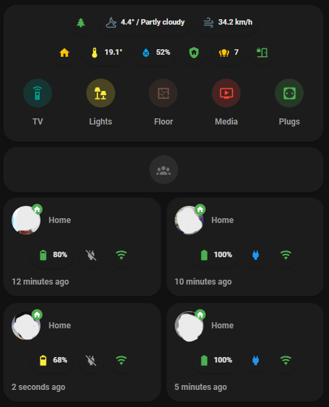
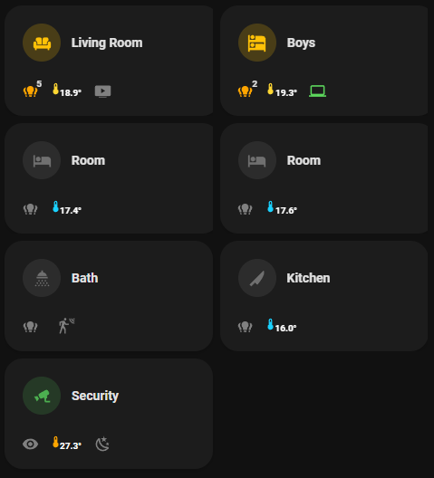
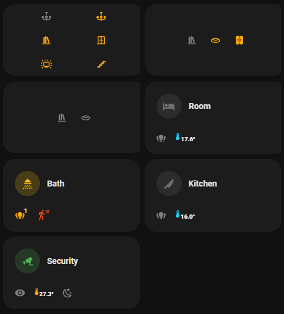
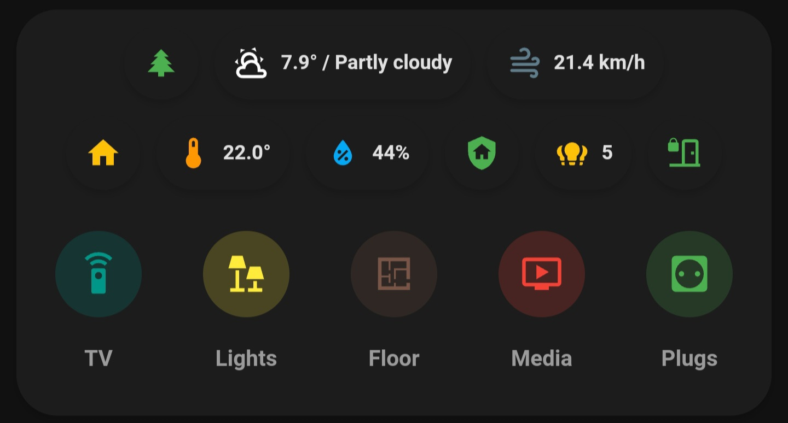
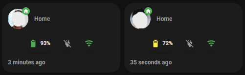
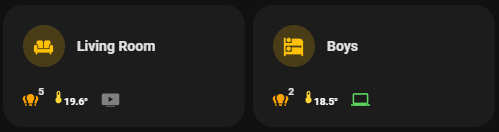
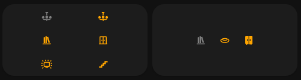

### This layout was only tested on/created for Android phones.
In this repo i will share with you how to create the **Header**, **Persons** and **Rooms** cards for this dashboard
***


### Rooms:
Before swipe:



After swipe:


***
## preparation:
### 1. you need to install the folowing integrations from HACS:
* [lovelace-mushroom](https://github.com/piitaya/lovelace-mushroom)
* [lovelace-mushroom-themes](https://github.com/piitaya/lovelace-mushroom-themes)
* [button-card](https://github.com/custom-cards/button-card)
* [stack-in-card](https://github.com/custom-cards/stack-in-card)
* [swipe-card](https://github.com/bramkragten/swipe-card)

### 2. you need to enable these sensors in the companion app:
* Battery sensors
* Network sensors
* location sensors

### 3. you need to have/create **groups** and lights count **sensors**:
<details>
  <summary>Living room Group example (Click to expand)</summary>
  
* paste this code to your **groups.yaml**
  
  ```
  living_room_lights:
    name: Living Room lights
    entities:
    - light.livingroom_lamp_1
    - light.livingroom_lamp_2
    - light.livingroom_lamp_3
    - light.livingroom_lamp_4
    - light.livingroom_lamp_5
  ```
  
</details>

<details>
  <summary>Livingroom Lights count example (Click to expand)</summary>
  
* paste this code to your **sensors.yaml**
* replace living room Area with in line 7 with your own.
  
  ```
  - platform: template
    sensors:
      livingroom_lights_of_count:
        friendly_name: 'Livingroom lights of count'
        unique_id: livingroom_lights_of_count
        value_template: >
          {{ expand(area_entities('Living room'))
            | selectattr('domain', 'in', ['light'])
            | selectattr('state', 'eq', 'on')
            | list | count
          }}
  ```
  
</details>

<details>
  <summary>Livingroom Lights count example (Click to expand)</summary>
  
* paste this code to your **sensors.yaml**
* replace Area's names in line 8 with your own.

  ```
  - platform: template
    sensors:
      lights_of_count:
        friendly_name: 'Lights of count'
        unique_id: lights_of_count
        value_template: > 
          
          
          
          
            
              
                
              
              
          
          {{ ns.lights| list | length }}
  ```
</details>

<details>
  <summary>All lights Group example (Click to expand)</summary>
  
* paste this code to your **groups.yaml**
  
  ```
  all_lights:
    name: All lights
    entities:
    - light.livingroom_lamp
    - light.front_door_lamp
    - light.bedroom_lamp
    - light.light.kilsmp
  ```
  
</details>

<details>
  <summary>All devices Group example (Click to expand)</summary>
  
* paste this code to your **groups.yaml**
  
  ```
  all_devices:
    name: All devices 
    entities:
    - light.livingroom_lamp
    - light.bedroom_lamp
    - switch.plug
    - media_plyer.tv
  ```
  
</details>

<details>
  <summary>All plugs Group example (Click to expand)</summary>
  
* paste this code to your **groups.yaml**
  
  ```
  all_plugs:
    name: All plugs
    entities:
    - switch.plug_1
    - switch.plug_2
    - switch.plug_3
  ```

</details>

### 4. you need to create these additional **sensors**:
<details>
  <summary>Battery icons & color based of phone battery level (Click to expand)</summary>
  
* paste this code to your **sensors.yaml** (replace the word *user* with your own name or family members names)
  
  ```
  - platform: template
    sensors:
      user_battery_icon:
        friendly_name: 'user battery icon'
        value_template: >
            
             mdi:battery-10
             mdi:battery-20
             mdi:battery-30
             mdi:battery-40
             mdi:battery-50
             mdi:battery-60
             mdi:battery-70
             mdi:battery-80
             mdi:battery-90
             mdi:battery
            
  - platform: template
    sensors:
      user_battery_color:
        friendly_name: 'user battery color'
        value_template: >
            
             red
             orange
             yellow
             green
            
  ```
  
</details>

<details>
  <summary> (for header) Temperature icon color based of temperature (Click to expand)</summary>
  
* paste this code to your **sensors.yaml** 

  ```
  - platform: template
    sensors:
      livingroom_temp_color_no_rgb:
        friendly_name: 'livingroom temp color no rgb'
        value_template: >
            
               blue
               yellow
               orange
               red
               grey
              
  ```
  
</details>


<details>
  <summary> (for rooms) Temperature icon color based of temperature (Click to expand)</summary>
  
* paste this code to your **sensors.yaml**
  
  ```       
  - platform: template
    sensors:
      livingroom_temp_color:
        friendly_name: 'livingroom temp color'
        value_template: >
            
               rgb(26, 209, 255)
               rgb(255, 214, 51)
               rgb(255, 163, 26)
               rgb(255, 51, 51)
               grey
              
  ```
  
</details>

### 5. To get the state of the laptop/PC in the Boys Room, i've used [HASS.Agent](https://github.com/LAB02-Research/HASS.Agent). otherwise remove it from code.

*****
**_(Note: make more sensors for every user & room you have)_**
*****


# Header card:


- Go to your dashboard add card then choose **Manual**.
- copy/paste the code below.
- in this card use the (for header) sensor from step .4 to avoid errors.
- replace entities like: lights count, groups, temperature sensors, nav bath, etc.. with your own entities.

<details>
  <summary>Yaml Code (Click to expand)</summary>

```
type: custom:stack-in-card
mode: vertical
keep:
  outer_padding: true
  margin: true
  box_shadow: false
  background: false
cards:
  - type: custom:mushroom-chips-card
    chips:
      - type: entity
        entity: zone.home
        icon_color: green
        name: Outside
        icon: mdi:pine-tree
        content_info: name
        tap_action:
          action: none
      - type: weather
        entity: weather.home_acc
        show_conditions: true
        show_temperature: true
      - type: entity
        entity: sensor.home_acc_wind
        icon: mdi:weather-windy
        icon_color: blue-grey
    alignment: center
  - type: custom:mushroom-chips-card
    chips:
      - type: template
        icon: mdi:home
        icon_color: |-
          
           amber
          
          
           grey
          
        tap_action:
          action: more-info
        entity: group.all_devices
      - type: template
        entity: sensor.livingroom_temperature
        icon_color: '{{states(''sensor.livingroom_temp_color_no_rgb'')}}'
        icon: mdi:thermometer
        use_entity_picture: true
        double_tap_action:
          action: none
        hold_action:
          action: none
        tap_action:
          action: more-info
        content: |-
          
            -
          
            {{states('sensor.livingroom_temperature')}}°
          
      - type: template
        entity: sensor.livingroom_humidity
        icon_color: light-blue
        icon: mdi:water-percent
        name: ''
        use_entity_picture: true
        tap_action:
          action: more-info
        content: |-
          
            -
          
            {{states('sensor.livingroom_humidity')}}%
          
      - type: entity
        entity: zone.home
        icon_color: green
        icon: mdi:shield-home
        name: Alarm
        content_info: none
        tap_action:
          action: navigate
          navigation_path: alarm
      - type: template
        icon: mdi:lightbulb-group
        content: '{{states(''sensor.lights_of_count'')}}'
        icon_color: |-
          
           grey
           amber
          
        entity: sensor.lights_of_count
      - type: template
        entity: binary_sensor.contact_sensor
        icon_color: |-
          
            green
          
            red
          
            red
          
        icon: |-
          
            mdi:door-closed-lock
          
            mdi:door-open
          
            mdi:progress-question
          
        name: ''
        use_entity_picture: true
        tap_action:
          action: more-info
    alignment: center
  - type: horizontal-stack
    cards:
      - type: custom:mushroom-entity-card
        entity: zone.home
        icon: mdi:remote
        icon_color: teal
        layout: vertical
        hold_action:
          action: none
        tap_action:
          action: navigate
          navigation_path: remote
        primary_info: none
        secondary_info: name
        name: TV
      - type: custom:mushroom-entity-card
        entity: group.all_lights
        icon_color: yellow
        secondary_info: name
        layout: vertical
        name: Lights
        tap_action:
          action: more-info
        primary_info: none
        icon: mdi:lamps
      - type: custom:mushroom-entity-card
        entity: zone.home
        icon: mdi:floor-plan
        icon_color: brown
        layout: vertical
        primary_info: none
        secondary_info: name
        tap_action:
          action: navigate
          navigation_path: floor-plane
        name: Floor
      - type: custom:mushroom-entity-card
        entity: group.all_plugs
        name: Media
        icon: mdi:television-play
        icon_color: red
        layout: vertical
        tap_action:
          action: navigate
          navigation_path: media
        secondary_info: name
        primary_info: none
      - type: custom:mushroom-entity-card
        entity: group.all_plugs
        name: Plugs
        icon: mdi:power-socket-eu
        icon_color: green
        layout: vertical
        tap_action:
          action: navigate
          navigation_path: plugs
        secondary_info: name
        primary_info: none
```
</details>

  
# Person cards:


- Go to your dashboard add card then choose **Manual**.
- copy/paste the code below.
- Replace "user" with your own user names.

<details>
  <summary>Yaml Code (Click to expand)</summary>

```
type: vertical-stack
cards:
  - type: horizontal-stack
    cards:
      - type: custom:stack-in-card
        cards:
          - type: custom:mushroom-person-card
            entity: person.user
            icon_type: entity-picture
            tap_action:
              action: more-info
            double_tap_action:
              action: none
            hold_action:
              action: none
            secondary_info: state
            layout: horizontal
            primary_info: none
            fill_container: true
          - type: custom:mushroom-chips-card
            chips:
              - type: template
                entity: sensor.user_battery_level
                icon: '{{states(''sensor.user_battery_icon'')}}'
                icon_color: '{{states(''sensor.user_battery_color'')}}'
                content: '{{states(''sensor.user_battery_level'')}}%'
                tap_action:
                  action: more-info
              - type: template
                entity: sensor.user_battery_level
                icon: >-
                  mdi:power-plug
                   mdi:power-plug-off                   
                icon_color: |-
                  blue
                   grey
                  
                content: ''
                tap_action:
                  action: none
              - type: template
                entity: sensor.user_network_type
                icon: |-
                  
                   mdi:wifi 
                  
                   mdi:signal-4g
                   mdi:network-strength-off
                    
                icon_color: |-
                  
                   green
                  
                   red
                   grey
                     
                content: ''
                hold_action:
                  action: none
                double_tap_action:
                  action: none
                tap_action:
                  action: none
            alignment: center
          - type: custom:mushroom-entity-card
            entity: device_tracker.user
            secondary_info: last-updated
            name: user
            primary_info: none
            fill_container: false
            icon: ''
            tap_action:
              action: more-info
            hold_action:
              action: none
            double_tap_action:
              action: none
            icon_type: none
      - type: custom:stack-in-card
        cards:
          - type: custom:mushroom-person-card
            entity: person.user
            icon_type: entity-picture
            tap_action:
              action: more-info
            double_tap_action:
              action: none
            hold_action:
              action: none
            secondary_info: state
            layout: horizontal
            primary_info: none
            fill_container: true
          - type: custom:mushroom-chips-card
            chips:
              - type: template
                entity: sensor.user_battery_level
                icon: '{{states(''sensor.user_battery_icon'')}}'
                icon_color: '{{states(''sensor.user_battery_color'')}}'
                content: '{{states(''sensor.user_battery_level'')}}%'
                tap_action:
                  action: more-info
              - type: template
                entity: sensor.user_battery_level
                icon: >-
                  mdi:power-plug
                   mdi:power-plug-off                   
                icon_color: |-
                  blue
                   grey
                  
                content: ''
                tap_action:
                  action: none
              - type: template
                entity: sensor.user_network_type
                icon: |-
                  
                   mdi:wifi 
                  
                   mdi:signal-4g
                   mdi:network-strength-off
                    
                icon_color: |-
                  
                   green
                  
                   red
                   grey
                     
                content: ''
                hold_action:
                  action: none
                double_tap_action:
                  action: none
                tap_action:
                  action: none
            alignment: center
          - type: custom:mushroom-entity-card
            entity: device_tracker.user
            secondary_info: last-updated
            name: user
            primary_info: none
            fill_container: false
            icon: ''
            tap_action:
              action: more-info
            hold_action:
              action: none
            double_tap_action:
              action: none
            icon_type: none

```
</details>

# Rooms cards:
before swipe:



After swipe:



- Go to your dashboard add card then choose **Manual**.
- copy/paste the code below.
- in this card use the (for rooms) sensor from step .4 to avoid errors.
- there is lines of code between "////////", this code just make empty lines, but is needed for the layout so keep them.
- remove these marks "////////" after you copy/paste the code.
- replace entities like: Lights, lights count, groups, temperature sensors, etc.. with your own entities.

<details>
  <summary>Yaml Code (Click to expand)</summary>
  
```
type: vertical-stack
cards:
  - type: horizontal-stack
    cards:
      - type: custom:swipe-card
        cards:
          - type: custom:stack-in-card
            mode: vertical
            keep:
              outer_padding: true
              box_shadow: false
              background: false
            cards:
              - type: custom:mushroom-template-card
                primary: Living Room
                secondary: ''
                icon: mdi:sofa
                layout: horizontal
                entity: group.living_room_lights
                icon_color: |-
                  
                  amber 
                  
                tap_action:
                  action: navigate
                  navigation_path: livingroom
                hold_action:
                  action: toggle
                double_tap_action:
                  action: none
                badge_color: ''
                badge_icon: ''
                fill_container: true
              - type: horizontal-stack
                cards:
                  - type: custom:button-card
                    tap_action:
                      action: none
                    state:
                      - operator: default
                        color: grey
                      - value: 'on'
                        color: orange
                    icon: mdi:lightbulb-group
                    entity: group.living_room_lights
                    styles:
                      icon:
                        - width: 19px
                      grid:
                        - position: relative
                      custom_fields:
                        notification:
                          - border-radius: 50%
                          - position: absolute
                          - left: 50%
                          - top: 3%
                          - height: 20px
                          - width: 20px
                          - font-size: 10px
                          - line-height: 20px
                          - font-weight: bold
                      card:
                        - border-radius: 50%
                        - width: 40px
                        - height: 40px
                    custom_fields:
                      notification: |
                        [[[
                           if (states['sensor.living_lights_of_count'].state == '0')
                            return ' '
                           return `${states['sensor.living_lights_of_count'].state}`
                        ]]]
                    name: ' '
                  - type: custom:button-card
                    state:
                      - value: 'on'
                    icon: mdi:thermometer
                    entity: sensor.livingroom_temperature
                    styles:
                      icon:
                        - color: |
                            [[[
                                return `${states['sensor.livingroom_temp_color'].state}`
                            ]]]
                        - width: 15px
                        - position: relative
                        - top: 4px
                        - right: 12px
                      card:
                        - border-radius: 80%
                        - width: 40px
                        - height: 40px
                      name:
                        - color: white
                        - font-size: 10px
                        - position: relative
                        - bottom: 10px
                        - left: 5px
                        - font-weight: bold
                    name: |
                      [[[
                        if (states['sensor.livingroom_temperature'].state == 'unavailable')
                         return '-'
                        return `${states['sensor.livingroom_temperature'].state}°`
                      ]]]
                  - type: custom:button-card
                    state:
                      - operator: default
                        color: grey
                      - value: 'on'
                        color: rgb(255, 51, 51)
                        styles:
                          card:
                            - border-radius: 50%
                    tap_action:
                      action: none
                    icon: mdi:youtube-tv
                    entity: media_player.TV-Name
                    styles:
                      icon:
                        - width: 19px
                      card:
                        - width: 40px
                        - height: 40px
                    name: ' '
          - type: custom:stack-in-card
            mode: vertical
            cards:
              - type: horizontal-stack
                cards:
                  - type: custom:button-card
                    color_type: blank-card
                  - type: custom:button-card
                    state:
                      - operator: default
                        color: grey
                      - value: 'on'
                        color: orange
                      - value: 'off'
                        color: grey
                        styles:
                          card:
                            - border-radius: 50%
                    icon: mdi:chandelier
                    tap_action:
                      action: toggle
                    entity: light.livingroom_lamp
                    styles:
                      icon:
                        - width: 18px
                      card:
                        - width: 40px
                        - height: 40px
                    name: ' '
                  - type: custom:button-card
                    color_type: blank-card
                  - type: custom:button-card
                    state:
                      - operator: default
                        color: grey
                      - value: 'on'
                        color: orange
                      - value: 'off'
                        color: grey
                        styles:
                          card:
                            - border-radius: 50%
                    icon: mdi:chandelier
                    tap_action:
                      action: toggle
                    entity: light.livingroom_lamp
                    styles:
                      icon:
                        - width: 18px
                      card:
                        - width: 40px
                        - height: 40px
                    name: ' '
                  - type: custom:button-card
                    color_type: blank-card
              - type: horizontal-stack
                cards:
                  - type: custom:button-card
                    color_type: blank-card
                  - type: custom:button-card
                    state:
                      - operator: default
                        color: grey
                      - value: 'on'
                        color: orange
                      - value: 'off'
                        color: grey
                        styles:
                          card:
                            - border-radius: 50%
                    icon: mdi:bookshelf
                    tap_action:
                      action: toggle
                    entity: light.livingroom_lamp
                    styles:
                      icon:
                        - width: 18px
                      card:
                        - width: 40px
                        - height: 40px
                    name: ' '
                  - type: custom:button-card
                    color_type: blank-card
                  - type: custom:button-card
                    state:
                      - operator: default
                        color: grey
                      - value: 'on'
                        color: orange
                      - value: 'off'
                        color: grey
                        styles:
                          card:
                            - border-radius: 50%
                    icon: mdi:door-sliding
                    tap_action:
                      action: toggle
                    entity: light.livingroom_lamp
                    styles:
                      icon:
                        - width: 18px
                      card:
                        - width: 40px
                        - height: 40px
                    name: ' '
                  - type: custom:button-card
                    color_type: blank-card
              - type: horizontal-stack
                cards:
                  - type: custom:button-card
                    color_type: blank-card
                  - type: custom:button-card
                    state:
                      - operator: default
                        color: grey
                      - value: 'on'
                        color: orange
                      - value: 'off'
                        color: grey
                        styles:
                          card:
                            - border-radius: 50%
                    icon: mdi:television-ambient-light
                    tap_action:
                      action: toggle
                    entity: light.livingroom_lamp
                    styles:
                      icon:
                        - width: 18px
                      card:
                        - width: 40px
                        - height: 40px
                    name: ' '
                  - type: custom:button-card
                    color_type: blank-card
                  - type: custom:button-card
                    state:
                      - operator: default
                        color: grey
                      - value: 'on'
                        color: orange
                      - value: 'off'
                        color: grey
                        styles:
                          card:
                            - border-radius: 50%
                    icon: mdi:stairs
                    tap_action:
                      action: toggle
                    entity: light.livingroom_lamp
                    styles:
                      icon:
                        - width: 18px
                      card:
                        - width: 40px
                        - height: 40px
                    name: ' '
                  - type: custom:button-card
                    color_type: blank-card
      - type: custom:swipe-card
        cards:
          - type: custom:stack-in-card
            mode: vertical
            keep:
              outer_padding: true
              box_shadow: false
              background: false
            cards:
              - type: custom:mushroom-template-card
                primary: Boys
                secondary: ''
                icon: mdi:bunk-bed
                layout: horizontal
                entity: group.bedroom_lights
                icon_color: |-
                  
                  amber 
                  
                tap_action:
                  action: navigate
                  navigation_path: bedroom
                hold_action:
                  action: toggle
                double_tap_action:
                  action: none
                badge_color: ''
                badge_icon: ''
                fill_container: true
              - type: horizontal-stack
                cards:
                  - type: custom:button-card
                    tap_action:
                      action: none
                    state:
                      - operator: default
                        color: grey
                      - value: 'on'
                        color: orange
                    icon: mdi:lightbulb-group
                    entity: group.bedroom_lights
                    styles:
                      icon:
                        - width: 19px
                      grid:
                        - position: relative
                      custom_fields:
                        notification:
                          - border-radius: 50%
                          - position: absolute
                          - left: 50%
                          - top: 3%
                          - height: 20px
                          - width: 20px
                          - font-size: 10px
                          - line-height: 20px
                          - font-weight: bold
                      card:
                        - border-radius: 50%
                        - width: 40px
                        - height: 40px
                    custom_fields:
                      notification: |
                        [[[
                           if (states['sensor.boys_lights_of_count'].state == '0')
                            return ' '
                           return `${states['sensor.boys_lights_of_count'].state}`
                        ]]]
                    name: ' '
                  - type: custom:button-card
                    state:
                      - value: 'on'
                    icon: mdi:thermometer
                    entity: sensor.boys_temperature
                    styles:
                      icon:
                        - color: |
                            [[[
                                return `${states['sensor.boys_temp_color'].state}`
                            ]]]
                        - width: 15px
                        - position: relative
                        - top: 4px
                        - right: 12px
                      card:
                        - border-radius: 80%
                        - width: 40px
                        - height: 40px
                      name:
                        - color: white
                        - font-size: 10px
                        - position: relative
                        - bottom: 10px
                        - left: 5px
                        - font-weight: bold
                    name: |
                      [[[
                        if (states['sensor.boys_temperature'].state == 'unknown')
                         return '-'
                        return `${states['sensor.boys_temperature'].state}°`
                      ]]]
          - type: custom:stack-in-card
            mode: vertical
            cards:
              - type: horizontal-stack
                cards:
//////////////////////////////////////////////////////////////////
                  - type: custom:button-card
                    state:
                      - operator: default
                        color: grey
                      - value: 'on'
                        color: orange
                      - value: 'off'
                        color: grey
                        styles:
                          card:
                            - border-radius: 50%
                    icon: none
                    tap_action:
                      action: none
                    entity: light.bedroom_lamp (put any light, wont show up, but is needed)
                    styles:
                      icon:
                        - width: 18px
                      card:
                        - width: 40px
                        - height: 40px
                    name: ' '
//////////////////////////////////////////////////////////////////
              - type: horizontal-stack
                cards:
                  - type: custom:button-card
                    color_type: blank-card
                  - type: custom:button-card
                    state:
                      - operator: default
                        color: grey
                      - value: 'on'
                        color: orange
                      - value: 'off'
                        color: grey
                        styles:
                          card:
                            - border-radius: 50%
                    icon: mdi:bookshelf
                    tap_action:
                      action: toggle
                    entity: light.bedroom_lamp
                    styles:
                      icon:
                        - width: 18px
                      card:
                        - width: 40px
                        - height: 40px
                    name: ' '
                  - type: custom:button-card
                    state:
                      - operator: default
                        color: grey
                      - value: 'on'
                        color: orange
                      - value: 'off'
                        color: grey
                        styles:
                          card:
                            - border-radius: 50%
                    icon: mdi:light-recessed
                    tap_action:
                      action: toggle
                    entity: light.bedroom_lamp
                    styles:
                      icon:
                        - width: 18px
                      card:
                        - width: 40px
                        - height: 40px
                    name: ' '
                  - type: custom:button-card
                    state:
                      - operator: default
                        color: grey
                      - value: 'on'
                        color: orange
                      - value: 'off'
                        color: grey
                        styles:
                          card:
                            - border-radius: 50%
                    icon: mdi:wardrobe
                    tap_action:
                      action: toggle
                    entity: light.bedroom_lamp
                    styles:
                      icon:
                        - width: 18px
                      card:
                        - width: 40px
                        - height: 40px
                    name: ' '
                  - type: custom:button-card
                    color_type: blank-card
//////////////////////////////////////////////////////////////////
              - type: horizontal-stack   
                cards:
                  - type: custom:button-card
                    state:
                      - operator: default
                        color: grey
                      - value: 'on'
                        color: orange
                      - value: 'off'
                        color: grey
                        styles:
                          card:
                            - border-radius: 50%
                    icon: none
                    tap_action:
                      action: none
                    entity: light.bedroom_lamp ( put any light, wont show up, but is needed)
                    styles:
                      icon:
                        - width: 18px
                      card:
                        - width: 40px
                        - height: 40px
                    name: ' '
//////////////////////////////////////////////////////////////////
```
</details>
